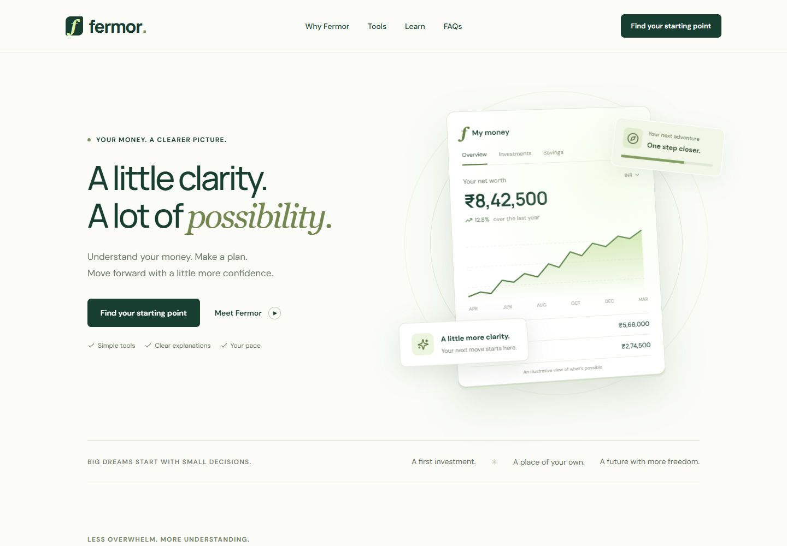
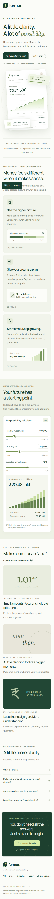

# Fermor — homepage concept

A responsive, original homepage for the Fermor frontend assessment. Built with Next.js App Router, React, TypeScript, and custom CSS. No backend, account, or API key is required.

**Live demo:** https://fermor-assessment.netlify.app/

**Repository:** https://github.com/Lohith625/fermor

## Screenshots

### Desktop



### Mobile



## Run locally

Requires Node.js 20.9 or newer. Validated with Next.js 16.4.

```bash
npm install
npm run dev
```

Open http://localhost:3000. To validate:

```bash
npm test
npm run typecheck
npm run build
```

## Deployment

Import the repository into Vercel using its Next.js preset. Alternatively, run `npm run build` and publish the generated `out` directory on a static host such as Netlify. No environment variables are required. This project intentionally uses static export.

## Design decisions

- **Audience:** young Indian professionals looking for a clear starting point for everyday money decisions.
- **Story:** understand, plan, grow. One consistent primary action leads to a useful calculator rather than multiple competing signup paths.
- **Visual direction:** forest green, pale lime, editorial typography, generous spacing, and custom financial UI. The hero is an interactive illustrative preview, not a connected account.
- **Scope:** a complete homepage, not a banking application. The calculator, preview tabs, mobile navigation, and FAQs work locally. Resource cards lead to Fermor's existing public website.
- **Original work:** no full-page template was copied. All layout, CSS, chart markup, and editorial typography compositions were created for this assessment. Tailark and Framer templates were considered during research but are not dependencies or asset sources.
- **Accessibility:** semantic landmarks, skip link, visible keyboard focus, native labeled range inputs, native disclosure elements, reduced-motion support, and responsive layouts.
- **Motion and depth:** pointer-driven CSS 3D transforms on the financial preview, a drawn SVG chart, one-time scroll reveals, and interpolated calculator amounts. The calculator chart plots actual intermediate balances. No WebGL model or animation library is needed. Touch devices skip pointer tilt; reduced-motion preferences disable animation. Static content stays readable without JavaScript, and assistive technology receives final numbers immediately.

## Calculator assumptions

The calculator models end-of-month contributions with monthly compounding at an assumed constant annual rate divided by 12. `FV = monthly × ((1 + annualRate/1200)^(years×12) - 1) / (annualRate/1200)`. At zero return, the result equals total contributions. Rates, periods, and contributions are constrained with range inputs. Results are illustrative, not forecasts or guarantees; taxes, fees, and inflation are excluded. Tests compare the formula to an independent month-by-month simulation and cover zero returns.

## Content and credits

Product research: https://fermor.in/. Company descriptions reflect its publicly available positioning; this is an independent assessment concept, not its official website. Dashboard amounts and charts are explicitly illustrative. No customer counts, testimonials, or performance claims have been invented.

Icons: Lucide (ISC license). Fonts: DM Sans and Manrope via Google Fonts (SIL Open Font License), with system fallbacks. No stock photography or copied template artwork is included.

AI assisted implementation; review the design and code and adapt the decisions to your own understanding before submitting.

## Submission checklist

- Push source and package-lock.json to a GitHub repository; exclude node_modules, .next, and out.
- Deploy and add the live URL and repository URL to your submission.
- Verify the deployed page on desktop and mobile, including calculator controls and external links.
- Be ready to explain the page hierarchy, calculator assumptions, responsive CSS, and tradeoffs above.
